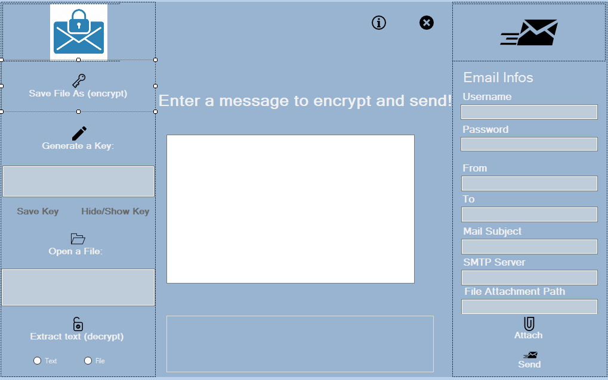

# `File Encryption with AES Algortihm`
In this project, I would like to develop a encryption program that protect our email contents 
from attackers. Therefore we used Google SMTP Service as mail service. Google's Gmail 
SMTP server is a free SMTP service which anyone who has a Gmail account can use to send 
emails. You can use it with personal emails, or even with your website if you are sending 
emails for things such as contact forms, newsletter blasts, or notifications.
For encryption side I use AES Encryption Service. Performs symmetric encryption and 
decryption using the Cryptographic Application Programming Interfaces (CAPI) 
implementation of the Advanced Encryption Standard (AES) algorithm.

In this project, I would like to develop a simple windows form interface that lets the user 
login with their email address and password. After that the user can write an email and click 
the send button. The application encrypts the email and sends it. The receiver gets the 
encrypted email and uses our app to decrypt the email. There are two sides about interface, 
encryption side and mail side. In encryption side mail sender can encrypt a message with a
file, decrypt an encrypted file, generate a key for this operations. On mail side sender enters 
own mail informations and can send the message to anybody.

## Tech and Libraries

- AES Encryption Service
- SMTP Gmail Service
- System Security Cryptography

## Screenshots
|  |
| :--:|
| *User Mail Form* |